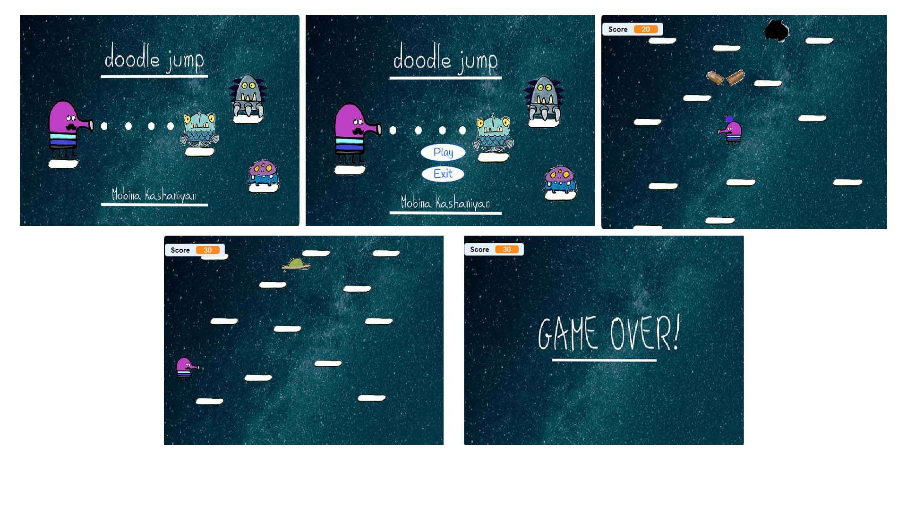

  
# doodle-jump
This repository contains a demo of the doodle jump game. 
I implemented this project for my foundation of computer and programming course. 

# Images
📸 The screenshot below is showing my project artwork. 
</img> 
</img> 

## Language 
This project is written in C .

## Contributing
Pull requests are welcome. For major changes, please open an issue first to discuss what you would like to change.

Please make sure to update tests as appropriate.

## License
[MIT](https://choosealicense.com/licenses/mit/)

